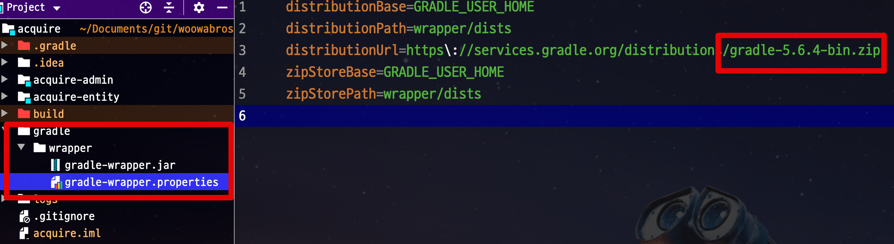

# AWS 배포를 위한 spring boot 개발 연습

## 프로젝트 구성

- java 8
- gradle 4.10
- spring boot version 2.1.7
- Junit4 (4버전에서는 이 애너테이션 필수 - @RunWith(SpringRunner.class))
- bootstrap 4.3.1


## 프로젝트 정보

- 현재 그레이들 버전이 다음과 같이 4.x 버전으로 설정된 것이 아닌지 확인한다.


- 4.x 버전으로 설정된 것이 아닌게 확인되면 프로젝트 폴더에서 터미널을 열고 다음과 같이 명령 실행한다.

```bash
cd <spring-boot-aws>경로
./gradlew wrapper --gradle-version 4.10.2
```

- 스프링 부트 버전은 2.1.7 , 2.1.8., 2.1.9.에서 선택한다  
  
- 템플릿 엔진으로 mustache를 사용하므로 vscode에 mustache 플러그인 설치  

- spring-security-oauth2
  - spring-security-auth2-autoconfigure를 사용하면 부트 1.5에서 사용하던 설정을 그대로 사용할 수 있지만 신규기능은 2부터 지원하기 때문에 여기서는 사용하지 않음
  - 1.5와 2.0의 설정 차이는 다음과 같다
  - 인터넷에 관련 정보 검색시 부트 버전과 spring-security-auth2-autoconfigure를 사용여부를 꼭 확인할 것
  - 2.0 버전들어오면서 CommonOAuth2Provider enum을 통해 구글, 깃헙, 페이스북, 옥타의 기본 설정값을 제공받을 수 있음
    - 다른 소셜 로그인(네이버, 카카오등)은 직접 다 추가해야한다.
```yml
# 1.5 
google:
  client:
    clientId: 인증정보
    clientSecret: 인증정보
    accessTokenUri: https://accounts.google.com/o/oauth2/token
    userAuthorizationUri: https://accounts.google.com/o/oauth2/auth
    clientAuthenticationScheme: form
  resource:
    userInfoUri: https://www.googleapis.com/oauth2/v2/userinfo

# 2
spring:
  security:
    oauth2:
      client:
        clientId: 인증정보
        clientSecret: 인증정보
```

- 이프로젝트에서는 구글 서비스 연동을 한다.
  - 구글 클라우드 플랫폼으로 [이동](https://console.cloud.google.com/)한다. 
  - 왼쪽 상단에 프로젝트 선택을 클릭
  - 새 프로젝트를 클릭
  - 등록될 서비스 이름(프로젝트 이름) 입력 후 생성
  - 왼쪽 메뉴에서 API 및 서비스 → 사용자 인증 정보 → 프로젝트 선택
  - 메뉴 상단에 +사용자 인증 정보 만들기 → OAuth 클라이언트 ID 클릭
  - 동의 화면 구성 클릭 → 내부, 외부 선택
  - 앱 등록 수정에서 정보 입력
    - 애플리케이션 이름: 구글 로그인시 노출될 애플리케이션 이름
    - 지원 이메일: 사용자 동의 화면에서 노출될 이메일. 보통은 서비스의 help 이메일 주소로 사용
  - API 범위에서는 email/profile/openid 기본 범위만 사용해서 세팅한다
    - API 범위는 구글 서비스에서 사용할 범위 목록이다
  - 다시 API 및 서비스의 왼쪽메뉴에서 +사용자 인증 정보 클릭 - (프로젝트 선택된 상태여야 함)
  - 유형 웹애플리케이션 선택, 이름에 값 설정, 승인된 리디렉션 URI 추가
    - 이 프로젝트에서는 다음과 같이 URI 추가함
    - http://localhost:8080/login/oauth2/code/google
  - 클라이언트 ID와 클라이언트 보안 비밀코드를 등록한다. 아래 코드 참조 - application-oauth.properties는 gitignore처리한다.
  - application-xxx.properties로 만들면 xxx라는 이름의 profile이 생성되어 이를 통해 관리할 수 있다.
    - profile=xxx라는 식으로 호출하면 해당 properties의 설정들을 가져올 수 있다.
    - 스프링 기본설정 파일에서 spring.profiles.include=oauth를 설정하여 파일의 정보를 포함하도록 구성한다.
```
spring.secuirty.oauth2.client.registration.google.client-id=클라이언트ID
spring.secuirty.oauth2.client.registration.google.client-secret=클라이언트 보안 비밀코드
scope=profile,email
```

- Google 승인된 리디렉션 URI란?
  - 서비스에서 파라미터로 인증 정보를 주었을 때 인증이 성공하면 구글에서 리다이렉트할 URL다
  - 스프링 부트 2 버전의 시큐리티에서는 기본적으로 {도메인}/login/oauth2/code/{소셜서비스코드}로 리다이렉트 URL를 지원한다.
  - 사용자가 별도록 리다이렉트 URL를 지원하는 Controller를 만들 필요가 없다. 시큐리티에서 이미 구현해 놓은 상태
  - 이 프로젝트는 테스트 용이기 때문에 http://localhost:8080/login/oauth2/code/google로만 사용함
  - AWS 서버에 배포하게 되면 localhost외 추가로 주소를 추가해야함

- 구글 로그인 연동 관련 클래스
  - com.hjt.domain.user.User - (사용자 정보)
  - com.hjt.domain.user.Role - (권한 정보)
  - com.hjt.domain.user.UserRepository - (사용자 엔티티 처리)
  - com.hjt.config.oauth.SecurityConfig - (스프링 시큐리티 설정)
  - com.hjt.config.oauth.CustomOAuth2Userservice - (OAuth 로그인 후 후속처리 클래스)
  - com.hjt.config.oauth.dto.OAuthAttributes - (OAuth2UserService를 통해 가져온 OAuth2User의 attribute를 담을 클래스)
  - com.hjt.config.oauth.dto.SessionUser - (세션에 인증된 사용자 정보 저장을 위한 클래스)

- HandlerMethodArgumentResolver를 구현하여 특정 메서드에 지정값으로 특정 파라미터를 넘길 수 있다.
  - com.hjt.config.oauth.LoginUser 
  - com.hjt.config.oauth.LoginUserArgumentResolver - HandlerMethodArgumentResolver 구현체
  - com.hjt.config.WebConfig - LoginUserArgumentResolver 설정

- 스프링 세션 저장소를 데이터베이스로 사용하기 위해 build.gradle에 라이브러리 설정 후 yml파일에 옵션 설정
  - JPA로 인해 SPRING_SESSION, SPRING_SESSION_ATTRIBUTES 테이블이 생성됨
  - 테이블 생성 스키마는 여기서 [확인](https://github.com/spring-projects/spring-session/tree/master/spring-session-jdbc/src/main/resources/org/springframework/session/jdbc)
```gradle
  compile('org.springframework.session:spring-session-jdbc')
```

```yml
  session:
    store-type: jdbc
```
### 프로젝트 팁

- CSS는 HTML 페이지 위쪽에 js및 js 관련 라이브러리는 HTML 페이지 아래쪽에 위치시킨다.
  - HTML 페이지가 js 때문에 로딩이 느려지는 현상을 방지한다.